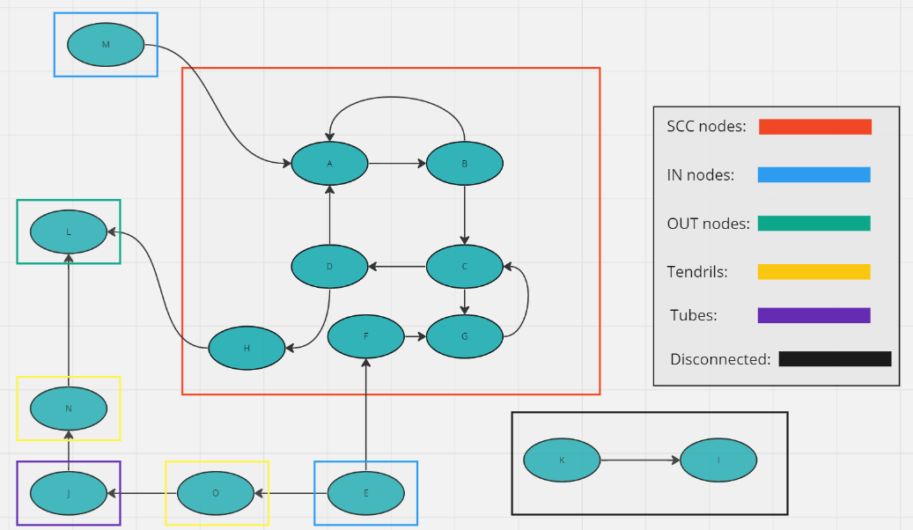
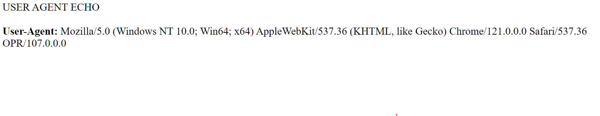
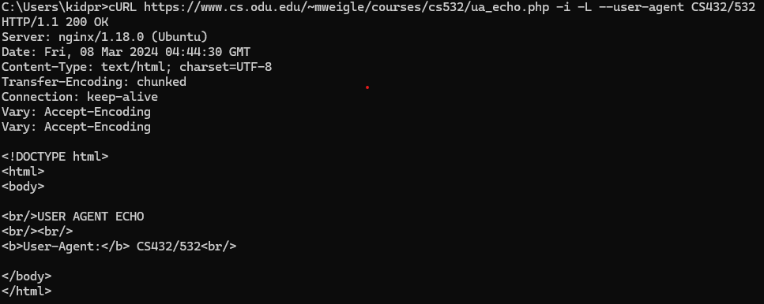
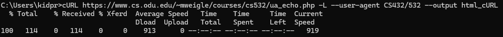
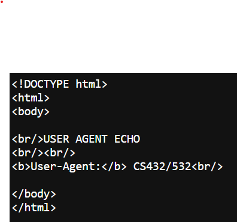

# HW1 - Web Science Intro
### Justin Jenkins
### CS 432, Spring 2024
### Mar 08, 2024 (extended)

# Q1

Consider the "bow-tie" structure of the web in the Broder et al. paper "Graph Structure in the Web" that was described in Module 1.

Now consider the following links:

A --> B
B --> A
B --> C
C --> D
C --> G
D --> A
D --> H
E --> F
E --> O
F --> G
G --> C
H --> L
J --> N
K --> I
M --> A
N --> L
O --> J
Draw the resulting directed graph (either sketch on paper or use another tool) showing how the nodes are connected to each other and include an image in your report. This does not need to fit into the bow-tie type diagram, but should look more similar to the graph on slide 24 from Module-01 Web-Science-Architecture.

For the graph, list the nodes (in alphabetical order) that are each of the following categories:

SCC:
IN:
OUT:
Tendrils:
indicate if the tendril is reachable from IN or can reach OUT
Tubes:
explain how the nodes serve as tubes
Disconnected:

## Q1 Answer

The example figure below shows the growth in the number of websites between 1993 and 1996.



I designed the graph using Miro, I just created every node first then started arranging them according to the connections made until it looked organized enough to label.  Node N is a tendril connected to the OUT node L, Node O is a tendril connected from the IN node E. Node J is the Tube connecting the two tendrils. Nodes K and I are completely disconnected from the rest of the graph, while Node M connects straight to the SCC nodes.

# Q2
Demonstrate that you know how to use `curl` and are familiar with the available options.  Complete the following steps using https://www.cs.odu.edu/~mweigle/courses/cs532/ua_echo.php as the URI to request. Explain the results you get from each step.

a) First, load the webpage at the URI in your web browser.  The result should show the "User-Agent" HTTP request header that your web browser sends to the web server. Take a screenshot to include in your report.

b) Use a single `curl` command with the appropriate options to do the following:
  * request the URI
  * show the HTTP response headers
  * follow any redirects
  * change the User-Agent HTTP request field to "CS432/532"

Take a screenshot of the `curl` command and options you used and the result of your execution to include in your report.

c) Use a single `curl` command with the appropriate options to do the following:
  * request the URI
  * follow any redirects
  * change the User-Agent HTTP request field to "CS432/532"
  * save the HTML output to a file

Take a screenshot of the `curl` command and options you used and the result of your execution to include in your report.  

d) View the HTML output file that was produced by `curl` from part c in a web browser and take a screenshot to include in your report.
## Answer
### a) 

### b) 

### c) 

### d) 

# Q3
For some of our later assignments, you will be analyzing large numbers of webpages. The goal of this question is to write a Python program to gather URIs of webpages that have enough text so they will be useful later.

Your program must do the following:
* take the URI of a seed webpage as a command-line argument
* extract all the links from the page's HTML
* for each link, request the URI and use the `Content-Type` HTTP response header to determine if the link references an HTML file (`text/html`)
    * if it does, use the `Content-Length` HTTP response header to determine if it contains more than 1000 bytes
       * if it does, then print the final URI (after any redirects) 

Use this program to collect at least 500 **unique** URIs of webpages that contain more than 1000 bytes.  Save the list of URIs to a file to use in later assignments.  The file must be uploaded to your GitHub repo.
## Answer
I used multiple links to generate 500 URIs rather than branching off one link. I wanted a larger variety of websites.

URIs used:

    "https://www.reddit.com/"
    
    "https://www.toyota.com/"
    
    "https://kbdfans.com/collections/keycaps"
    
    "https://en.wikipedia.org/wiki/1996_Men%27s_Ice_Hockey_World_Championships"
    
    "https://www.youtube.com"
    
    "https://en.wikipedia.org/wiki/Web_science" 
    
    "https://github.com/VAST-AI-Research/TripoSR"
    
    "https://www.chevrolet.com"
    
    "https://www.samsung.com/us/"
    
    "https://www.aliexpress.us"
    
    "https://zoom.us"
    
    "https://portal.odu.edu"
    
    
Results are in links.txt in the main repository.
    
#### Code without comments (simpleWebCrawler.py):
```
html_doc = requests.get(url, timeout=5).text

soup = BeautifulSoup(html_doc, 'html.parser')

for link in soup.find_all('a', attrs={'href': re.compile("^https://")}):
    print(link.get('href'))

    exists = False

    fileLinks = open ("links.txt", "a+")
    
    for line in fileLinks : 
        if line == link.get('href') :
            exists = True

    if exists == False :       
        fileLinks.write(link.get('href'))
        fileLinks.write("\n")
    fileLinks.close()
```

# References

*Every report must list the references that you consulted while completing the assignment. If you consulted a webpage, you must include the URL.  These are just a couple examples.*

* Stack Overflow, How can I parse (read) and use JSON in Python?, <https://stackoverflow.com/questions/7771011/how-can-i-parse-read-and-use-json-in-python>
* ChatGPT conversation, Initial prompt: "write a python line to detect if a string ends with .png", <https://chat.openai.com/share/5de76e93-c26b-4665-a0fc-b782b01a9285>
