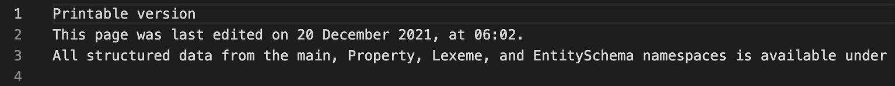

# HW2 - Ranking Webpages
### Justin Jenkins
### CS 432, Spring 2024
### Mar 8, 2024 (extended)

# Q1

*You may copy the question into your report, but make sure that you make it clear where the question ends and your answer begins.*

## Answer

After attempting to download all the raw HTML files, I was left with only 357 .html files. Following which it dropped down to 351 'boiled' files, including numerous with useless information or empty files. I am not particularly suprised by this. Included is an example of a useless but not empty .html file after the boilerplate content was removed.



This makes sense to me as many links will contain small things meant for specific or small purposes, many do not have the purpose of conveying information but instead giving functionality that will be removed when we filter out boilerplate content.
I converted all the names of files to md5sum as suggested and further converted the content to hexadecimal with .hexdigest(). To remove boilerplate content I also followed the suggestion of boilerpy3.

code without comments, used a main function to run everything.
```
def main():
    linksFile = open("links.txt", 'r')
    for uRI in linksFile:
        uRI = uRI.strip()
        filename = md5Name(uRI)
        downloadFile(uRI, filename)
    boilFile()
    
def md5Name(uRI):
    hashed = hashlib.md5(uRI.encode())

    md5map = open("md5_to_URI.txt", 'a')
    md5map.write(hashed.hexdigest() + " = " + uRI + "\n")
    md5map.close()

    return hashed.hexdigest() + ".html"

def downloadFile(uRI, filename):
    try:
        response = requests.get(uRI)
        # only tries to save the document if it receives
        # a status code of 200 indicating successful connection
        # as this is a get request 200 will work for most cases
        if response.status_code == 200:
            # creates path towards the correct folder and 
            # saves the data into that folder
            filepath = f"./CS432_HW2/RawFiles/{filename}"
            file = open (filepath, 'w')
            file.write(response.text)
            file.close()

    except Exception as error:
        print(f"Error from url  {uRI}:\n {error}")

def boilFile() : 
    
    boiler = extractors.ArticleExtractor()

    for rawFile in os.listdir("./CS432_HW2/RawFiles") : 
        filePath = f"./CS432_HW2/RawFiles/{rawFile}"
        boiledFilePath = f"./CS432_HW2/ProcessedFiles/{rawFile}"
        try: 
            file = open(filePath, 'r')
            html = file.read()
            file.close()
            
            boiledContent = boiler.get_content(html)

            boiledFile = open(boiledFilePath, 'w')
            boiledFile.write(boiledContent)
            boiledFile.close()

        except Exception as error:
            print(f"Error at {filePath}: {error}")
```


# Q2

## Answer

# Q3

## Answer

# References

*Every report must list the references that you consulted while completing the assignment. If you consulted a webpage, you must include the URL.  These are just a couple examples.*

* Stack Overflow, How can I parse (read) and use JSON in Python?, <https://stackoverflow.com/questions/7771011/how-can-i-parse-read-and-use-json-in-python>
* ChatGPT conversation, Initial prompt: "write a python line to detect if a string ends with .png", <https://chat.openai.com/share/5de76e93-c26b-4665-a0fc-b782b01a9285>
